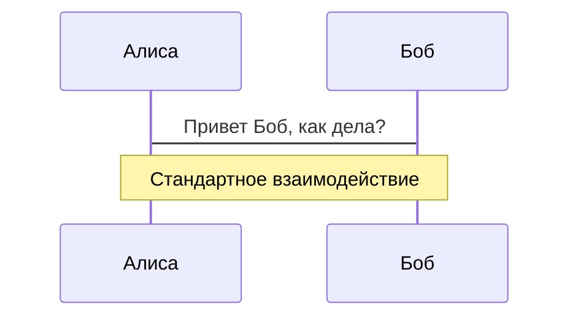
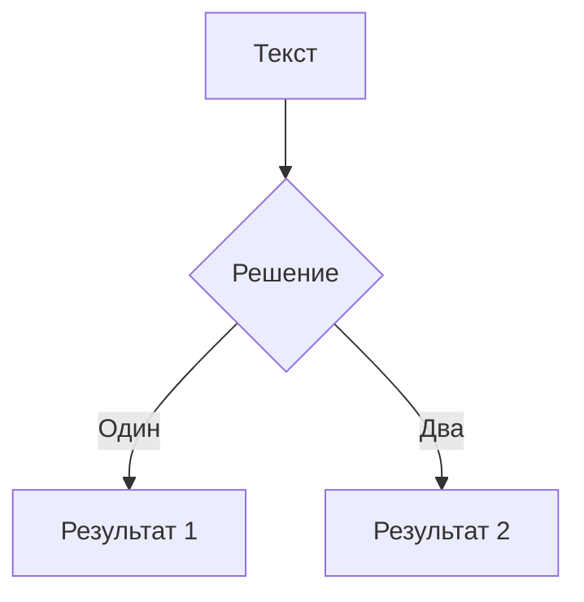

---
# основная тема
theme: seriph
# случайное изображение для заднего фона из Unsplash коллекции
background: https://source.unsplash.com/collection/94734566/1920x1080
# применить этот Windi CSS класс к текущему слайду
class: 'text-center'
# подсветка кода https://sli.dev/custom/highlighters.html
highlighter: shiki
# показывать ли номер линии в блоках с кодом
lineNumbers: false
# дополнительная информация о слайдах
info: |
  ## Курсовая работа по Slidev
  Выполнил Гусельников Валентин, ВТиП-402, Торайгыров университет, 2021 г.
---

# Добро пожаловать в Slidev

Слайды презентаций для разработчиков

<div class="pt-12">
  <span @click="$slidev.nav.next" class="px-2 py-1 rounded cursor-pointer" hover="bg-white bg-opacity-10">
    Нажмите Space чтобы перейти на следующую страницу <carbon:arrow-right class="inline"/>
  </span>
</div>

<div class="abs-br m-6 flex gap-2">
  <button @click="$slidev.nav.openInEditor()" title="Открыть в редакторе" class="text-xl icon-btn opacity-50 !border-none !hover:text-white">
    <carbon:edit />
  </button>
  <a href="https://github.com/slidevjs/slidev" target="_blank" alt="GitHub"
    class="text-xl icon-btn opacity-50 !border-none !hover:text-white">
    <carbon-logo-github />
  </a>
</div>

<!--
Последний комментарий в виде блока каждого слайда будет использован в качестве заметок.
Он будет отображаться в режиме Презентации вместе со слайдом
[Подробнее в документации](https://sli.dev/guide/syntax.html#notes)
-->

---

# Первый слайд

Текст в первом слайде

---

# Второй слайд

Текст второго слайда

---

# Что такое Slidev?

Slidev это создатель слайдов и презентатор, предназначенный для разработчиков, имеющий следующие возможности

- 📝 **Основан на тексте** - сосредоточьтесь на содержимом с помощью Markdown, а стилизуйте позже
- 🎨 **Темы** - темами можно делиться и использовать с помощью пакетов npm
- 🧑‍💻 **Для разработчиков** - подсветка кода, live coding с автодополнением
- 🤹 **Интерактивность** - встраивание компонентов Vue для улучшения презентации
- 🎥 **Запись** - встроенная запись и просмотр камеры
- 📤 **Портативность** - экспорт в PDF, PNG или даже в SPA (Single Page Application)
- 🛠 **Кастомизация** - на веб-странице возможно все

<br>
<br>

Более подробно [Почему Slidev?](https://sli.dev/guide/why)

<!--
Можно использовать `style` тэг в markdown чтобы изменить стиль текущего слайда.
Подробнее: https://sli.dev/guide/syntax#embedded-styles
-->

<style>
h1 {
  background-color: #2B90B6;
  background-image: linear-gradient(45deg, #4EC5D4 10%, #146b8c 20%);
  background-size: 100%;
  -webkit-background-clip: text;
  -moz-background-clip: text;
  -webkit-text-fill-color: transparent; 
  -moz-text-fill-color: transparent;
}
</style>

---
layout: image-right
image: https://source.unsplash.com/collection/94734566/1920x1080
---

# Код

Используй фрагменты кода и получайте его подсветку![^1]

```ts {all|2|1-6|9|all}
interface User {
  id: number
  firstName: string
  lastName: string
  role: string
}

function updateUser(id: number, update: User) {
  const user = getUser(id)
  const newUser = {...user, ...update}  
  saveUser(id, newUser)
}
```

<arrow v-click="3" x1="400" y1="420" x2="230" y2="330" color="#564" width="3" arrowSize="1" />

[^1]: [Подробнее](https://sli.dev/guide/syntax.html#line-highlighting)

<style>
.footnotes-sep {
  @apply mt-20 opacity-10;
}
.footnotes {
  @apply text-sm opacity-75;
}
.footnote-backref {
  display: none;
}
</style>

---

# Компоненты

<div grid="~ cols-2 gap-4">
<div>

Можно использовать Vue компоненты внутри слайдов.

Есть несколько встроенных компонентов, например `<Tweet/>` и `<Youtube/>` которые можно использовать сразу. А добавление своих компонентов очень просто.

```html
<Counter :count="10" />
```

<!-- ./components/Counter.vue -->
<Counter :count="10" m="t-4" />

Подробнее [в официальной документации](https://sli.dev/builtin/components.html).

</div>
<div>

```html
<Tweet id="1390115482657726468" />
```

<Tweet id="1390115482657726468" scale="0.65" />

</div>
</div>


---
class: px-20
---

# Темы

Slidev поставляется с мощной поддержкой тем. Темы могут предоставлять стили, макеты, компоненты или даже конфигурации для инструментов. Переключение между темами осуществляется всего лишь **одной правкой** в frontmatter:

<div grid="~ cols-2 gap-2" m="-t-2">

```yaml
---
theme: default
---
```

```yaml
---
theme: seriph
---
```


</div>

Читайте подробнее [Как использовать тему](https://sli.dev/themes/use.html) и
посмотрите [Галерею тем](https://sli.dev/themes/gallery.html).

---
preload: false
---

# Анимации

Анимации осуществляются с помощью [@vueuse/motion](https://motion.vueuse.org/).

```html
<div
  v-motion
  :initial="{ x: -80 }"
  :enter="{ x: 0 }">
  Slidev
</div>
```

<div class="w-60 relative mt-6">
  <div class="relative w-40 h-40">
    
    
    
  </div>

  <div 
    class="text-5xl absolute top-14 left-40 text-[#2B90B6] -z-1"
    v-motion
    :initial="{ x: -80, opacity: 0}"
    :enter="{ x: 0, opacity: 1, transition: { delay: 2000, duration: 1000 } }">
    Slidev
  </div>
</div>

<!-- скрипты настройки vue могут быть напрямую использованы в markdown, и будут влиять только на текущую страницу -->
<script setup lang="ts">
const final = {
  x: 0,
  y: 0,
  rotate: 0,
  scale: 1,
  transition: {
    type: 'spring',
    damping: 10,
    stiffness: 20,
    mass: 2
  }
}
</script>

<div
  v-motion
  :initial="{ x:35, y: 40, opacity: 0}"
  :enter="{ y: 0, opacity: 1, transition: { delay: 3500 } }">

[Подробнее](https://sli.dev/guide/animations.html#motion)

</div>

---

# LaTeX

LaTeX поддерживается из коробки благодаря [KaTeX](https://katex.org/).

<br>

Inline $\sqrt{3x-1}+(1+x)^2$

Block
$$
\begin{array}{c}

\nabla \times \vec{\mathbf{B}} -\, \frac1c\, \frac{\partial\vec{\mathbf{E}}}{\partial t} &
= \frac{4\pi}{c}\vec{\mathbf{j}}    \nabla \cdot \vec{\mathbf{E}} & = 4 \pi \rho \\

\nabla \times \vec{\mathbf{E}}\, +\, \frac1c\, \frac{\partial\vec{\mathbf{B}}}{\partial t} & = \vec{\mathbf{0}} \\

\nabla \cdot \vec{\mathbf{B}} & = 0

\end{array}
$$

<br>

[Подробнее](https://sli.dev/guide/syntax#latex)

---

# Диаграммы

Можно создавать диаграммы / графы из текстового описания прямо в Markdown.

<div class="grid grid-cols-2 gap-10 pt-4 -mb-6">





</div>

[Подробнее](https://sli.dev/guide/syntax.html#diagrams)


---
layout: center
class: text-center
---

# Ознакомиться подробнее

[Документация](https://sli.dev) · [GitHub](https://github.com/slidevjs/slidev) · [Примеры](https://sli.dev/showcases.html)
